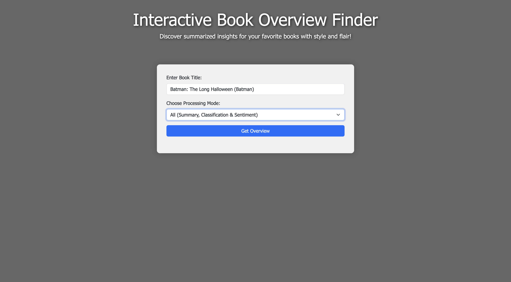
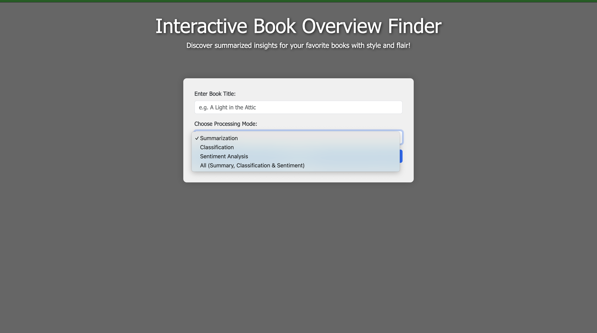
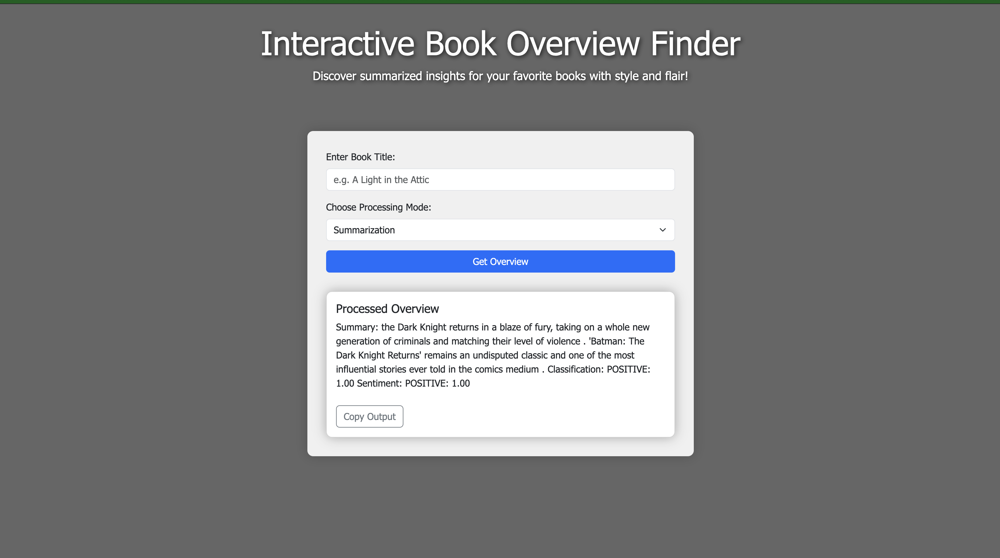
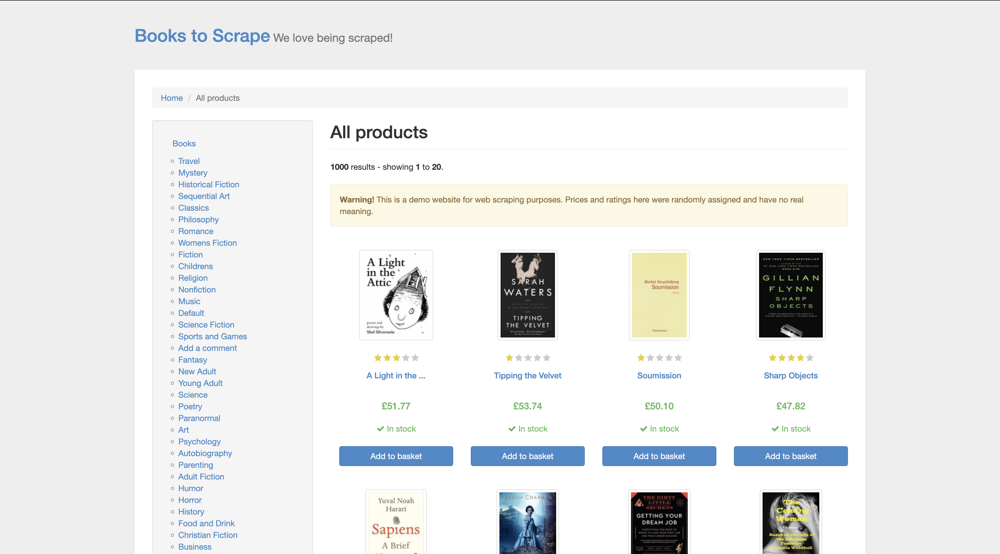

<h1 style="color: #2F4F4F; text-align:center;"><b>BookScraper-ML</b></h1>

  <em>A Python-based web scraping and NLP project for extracting and processing book data.</em>

<h2 style="color:#4169E1;">1. Overview</h2>

  BookScraper-ML is designed for developers and enthusiasts looking to explore web scraping and natural language processing.
  This project scrapes detailed book data—including titles, prices, ratings, availability, and full descriptions—from the 
  <a href="http://books.toscrape.com/" target="_blank">Books to Scrape</a> demo website. The data is stored in CSV format and 
  an SQLite database, and is processed using pretrained NLP pipelines to provide:

<ul>
  <li><strong>Summarization:</strong> A concise summary of each book's description.</li>
  <li><strong>Classification:</strong> Labels and confidence scores for categorizing the description.</li>
  <li><strong>Sentiment Analysis:</strong> An indication of the overall sentiment.</li>
  <li><strong>All (Combined):</strong> A complete output with all three modes.</li>
</ul>

<h2 style="color:#4169E1;">2. Project Structure</h2>

<pre>
BookScraper-ML/
├── app/
│   ├── templates/
│   │   └── index.html          # UI template with interactive design
│   └── main.py                 # Flask backend for UI and API
├── data/
│   └── books_data.csv          # CSV generated by scrapper.py
├── db/
│   ├── books.db                # SQLite database (populated via init_db.py)
│   └── init_db.py              # Script to initialize and populate the database
├── env2/                       # Virtual environment (ignored by Git)
├── model/
│   └── book_model.py           # Pretrained NLP pipelines for processing
├── scrapper.py                 # Web scraping script to collect book data
├── requirements.txt            # Python dependencies
├── .gitignore                  # Git ignore rules
└── README.md                   # Project documentation (this file)
</pre>

<h2 style="color:#4169E1;">3. Data</h2>

  The project scrapes data from <a href="http://books.toscrape.com/" target="_blank">Books to Scrape</a> and saves it to 
  <code>books_data.csv</code>. The CSV includes:

<ul>
  <li><strong>Title</strong></li>
  <li><strong>Price</strong></li>
  <li><strong>Availability</strong></li>
  <li><strong>Rating</strong></li>
  <li><strong>Detail URL</strong></li>
  <li><strong>Description</strong> (scraped from each book's detail page)</li>
</ul>

<h2 style="color:#4169E1;">4. Installation</h2>

<ol>
  <li>
    <strong>Clone this repository:</strong>
    <pre><code>git clone https://github.com/&lt;YourUsername&gt;/bookscraper-ml.git
cd bookscraper-ml</code></pre>
  </li>
  <li>
    <strong>Create and activate a virtual environment (optional):</strong>
    <pre><code>python3 -m venv env2
source env2/bin/activate    # On Windows: env2\Scripts\activate</code></pre>
  </li>
  <li>
    <strong>Install dependencies:</strong>
    <pre><code>pip install -r requirements.txt</code></pre>
  </li>
</ol>

<h2 style="color:#4169E1;">5. Usage</h2>

<ol>
  <li>
    <strong>Scrape the Data:</strong>
    <pre><code>python3 scrapper.py</code></pre>
    This generates <code>books_data.csv</code> in the <code>data/</code> folder.
  </li>
  <li>
    <strong>Initialize the Database:</strong>
    <pre><code>python3 db/init_db.py</code></pre>
    This populates <code>books.db</code> with the scraped data.
  </li>
  <li>
    <strong>Run the Flask Application:</strong>
    <pre><code>python3 app/main.py</code></pre>
    Open [http://127.0.0.1:5000/](http://127.0.0.1:5000/) in your browser.
  </li>
  <li>
    <strong>Interact with the UI:</strong>
    <ul>
      <li>Enter the exact book title and select a processing mode.</li>
      <li>Modes available: Summarization, Classification, Sentiment Analysis, or All (combined).</li>
      <li>Your search input persists until you manually change it.</li>
      <li>Click the <strong>Copy Output</strong> button to copy the processed overview.</li>
    </ul>
  </li>
</ol>

## Screenshots

Below are some demonstration images of the project:

### Book Search Interface

### Homepage

### Processed Overview Result

### Target Website

<h2 style="color:#4169E1;">6. Contributing</h2>

  Contributions are welcome! Feel free to open issues or submit pull requests to improve this project.

<h2 style="color:#4169E1;">7. License</h2>

  This project is licensed under the <strong>MIT License</strong>. See the <code>LICENSE</code> file for details.

  <em>Made with ❤️ by &lt;Deep Habiswashi&gt;</em>

